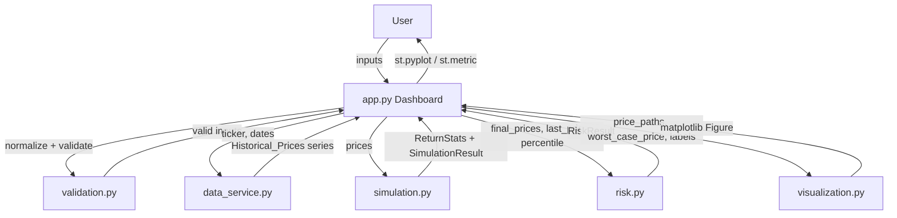
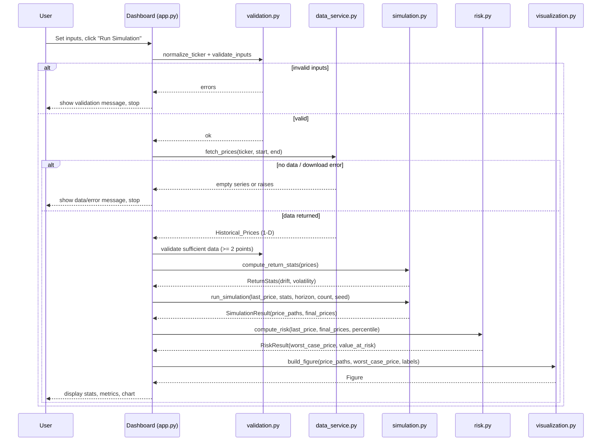

# Design Document

## Overview

This feature transforms the existing single-file `monte_carlo.py` command-line script into an interactive, configurable Streamlit dashboard backed by a modular Python package. The dashboard lets a user enter a ticker symbol, choose a historical date range, set the number of simulations, and pick a Value at Risk (VaR) percentile. On demand, it downloads historical closing prices from Yahoo Finance, derives daily-return statistics (drift and volatility), simulates future price paths with Geometric Brownian Motion (GBM), computes the VaR threshold, and renders the simulated paths with the VaR line.

The design deliberately separates concerns into cohesive modules that map one-to-one to the components named in the requirements Glossary. The Streamlit layer (`app.py`) owns only user interaction, input validation orchestration, and result presentation. All numerical work lives in pure, side-effect-free functions (`simulation.py`, `risk.py`) that are straightforward to test with property-based testing. Data retrieval (`data_service.py`) and rendering (`visualization.py`) are isolated behind small interfaces so they can be mocked or swapped.

### Design Goals

- **Modularity**: one module per glossary component, each with a single responsibility.
- **Testability**: keep the math pure (NumPy in, NumPy out) so correctness properties can be verified with Hypothesis.
- **Fidelity to the original**: preserve the exact GBM formula, `pct_change` return calculation, `mean`/`std` statistics, and `np.percentile` VaR logic from `monte_carlo.py`.
- **Clear boundaries**: I/O (network, plotting, Streamlit widgets) is separated from computation.

### Key Design Decisions

- **Streamlit for the UI** — it is the tool named in the requirements introduction and provides all needed widgets (`text_input`, `date_input`, `number_input`, `button`, `spinner`, `pyplot`, `metric`) with minimal boilerplate. ([Streamlit widgets API](https://docs.streamlit.io/develop/api-reference/widgets))
- **Pure computation layer** — `simulation.py` and `risk.py` accept plain values / NumPy arrays and return NumPy arrays or scalars. No Streamlit, no network, no plotting. This makes the core logic deterministic under a seeded RNG and directly testable.
- **Dataclasses for data transfer** — small frozen dataclasses (`SimulationInputs`, `ReturnStats`, `SimulationResult`, `RiskResult`) carry data between modules with explicit, typed contracts instead of loose tuples or dicts.
- **Hypothesis for property-based testing** — the numerical modules have clear universal properties (path count, starting price, VaR ordering, statistics correctness) that are well suited to PBT. ([Hypothesis for the scientific stack](https://hypothesis.readthedocs.io/en/latest/numpy.html))
- **Validation as pure functions** — `validation.py` holds pure predicate/normalization functions the Dashboard calls before running anything, keeping validation rules testable independent of Streamlit.

## Architecture

### Component Responsibilities

| Module | Glossary Component | Responsibility |
| --- | --- | --- |
| `app.py` | Dashboard | Streamlit entrypoint: render widgets, collect inputs, run validation, orchestrate the pipeline, display progress and results. |
| `validation.py` | Dashboard (support) | Pure functions to normalize the ticker and validate inputs (date range, simulation count, percentile, data sufficiency). |
| `data_service.py` | Data_Service | Download historical closing prices from Yahoo Finance and return a 1-D price series. |
| `simulation.py` | Simulation_Engine | Compute daily returns, drift, volatility; run the GBM Monte Carlo simulation; extract final prices. |
| `risk.py` | Risk_Calculator | Compute the worst-case price at a percentile and the Value at Risk. |
| `visualization.py` | Visualizer | Build the matplotlib figure of price paths plus the VaR threshold line. |
| `models.py` | (shared) | Dataclasses used to pass data between modules. |

### Data Flow



### Execution Sequence



### Proposed File / Folder Layout

```
monte_carlo_dashboard/
├── app.py                     # Streamlit entrypoint (run: streamlit run app.py)
├── monte_carlo.py             # existing script (kept for reference / not modified)
├── requirements.txt           # dependencies: streamlit, yfinance, numpy, pandas, matplotlib
├── src/
│   └── monte_carlo_dashboard/
│       ├── __init__.py
│       ├── models.py          # dataclasses: SimulationInputs, ReturnStats, SimulationResult, RiskResult, ValidationResult
│       ├── validation.py      # normalize_ticker, validate_inputs, has_sufficient_data
│       ├── data_service.py    # fetch_prices
│       ├── simulation.py      # compute_return_stats, run_simulation
│       ├── risk.py            # compute_worst_case_price, compute_value_at_risk, compute_risk
│       └── visualization.py   # build_figure
└── tests/
    ├── test_validation.py
    ├── test_simulation.py     # property-based (Hypothesis)
    ├── test_risk.py           # property-based (Hypothesis)
    └── test_data_service.py   # mock-based unit / integration
```

`app.py` sits at the repo root so the app runs with `streamlit run app.py`. It imports from the `src/monte_carlo_dashboard` package. The existing `monte_carlo.py` is left in place as a reference and is not imported by the new package.

## Components and Interfaces

### `models.py`

```python
from dataclasses import dataclass
import numpy as np

@dataclass(frozen=True)
class SimulationInputs:
    ticker: str            # normalized (uppercase, trimmed)
    start_date: date
    end_date: date
    simulation_count: int  # 1..10000
    var_percentile: float  # 1..99
    horizon: int = 30      # trading days

@dataclass(frozen=True)
class ReturnStats:
    drift: float           # mu: mean of daily returns
    volatility: float      # sigma: std of daily returns

@dataclass(frozen=True)
class SimulationResult:
    price_paths: np.ndarray   # shape (horizon, simulation_count)
    final_prices: np.ndarray  # shape (simulation_count,) == price_paths[-1]

@dataclass(frozen=True)
class RiskResult:
    last_price: float
    worst_case_price: float
    value_at_risk: float      # last_price - worst_case_price

@dataclass(frozen=True)
class ValidationResult:
    is_valid: bool
    errors: list[str]         # human-readable messages for the Dashboard to show
```

### `validation.py` (Dashboard support)

```python
def normalize_ticker(raw: str) -> str:
    """Trim leading/trailing whitespace and uppercase. (Req 1.4)"""

def validate_inputs(
    ticker: str,
    start_date: date,
    end_date: date,
    simulation_count: int,
    var_percentile: float,
    today: date,
) -> ValidationResult:
    """Validate ticker non-empty, start < end, end <= today,
    1 <= simulation_count <= 10000, 1 <= var_percentile <= 99.
    (Req 1.3, 2.3, 2.4, 3.3, 3.4, 4.3, 4.4)"""

def has_sufficient_data(prices) -> bool:
    """True if there are at least 2 historical price points. (Req 2.5)"""
```

### `data_service.py` (Data_Service)

```python
import pandas as pd

def fetch_prices(ticker: str, start_date: date, end_date: date) -> pd.Series:
    """Download adjusted closing prices from Yahoo Finance for the ticker
    over [start_date, end_date) and return a 1-D Series of closing prices.

    Mirrors monte_carlo.py:
        yf.download(ticker, start=..., end=..., auto_adjust=True)['Close'].squeeze()

    Returns an empty Series if no data is found. (Req 5.1, 5.2, 5.3)
    Propagates download errors to the caller for the Dashboard to handle. (Req 5.4)
    """
```

The Dashboard wraps `fetch_prices` in a try/except and inspects emptiness so it can show the correct message for the "no data" (Req 5.3) versus "download error" (Req 5.4) cases.

### `simulation.py` (Simulation_Engine)

```python
import numpy as np

def compute_return_stats(prices) -> ReturnStats:
    """Daily returns = prices.pct_change().dropna();
    drift = returns.mean(); volatility = returns.std().
    (Req 6.1, 6.2, 6.3)"""

def run_simulation(
    last_price: float,
    stats: ReturnStats,
    simulation_count: int,
    horizon: int = 30,
    rng: np.random.Generator | None = None,
) -> SimulationResult:
    """Run GBM Monte Carlo. Every path starts at last_price (Req 7.1).
    Grid shape is (horizon, simulation_count) (Req 7.2, 7.3).
    Each step: price[t] = price[t-1] * exp((mu - 0.5*sigma^2) + sigma * Z)
    where Z ~ N(0,1) (Req 7.4).
    final_prices = price_paths[-1] (Req 7.5).

    An injectable rng makes runs deterministic for tests.
    """
```

The GBM step reproduces the original loop from `monte_carlo.py`:
`price_paths[t] = price_paths[t-1] * np.exp((mu - 0.5 * sigma**2) + sigma * random_shocks[t])`.

### `risk.py` (Risk_Calculator)

```python
import numpy as np

def compute_worst_case_price(final_prices, var_percentile: float) -> float:
    """np.percentile(final_prices, var_percentile). (Req 8.1)"""

def compute_value_at_risk(last_price: float, worst_case_price: float) -> float:
    """last_price - worst_case_price. (Req 8.2)"""

def compute_risk(last_price: float, final_prices, var_percentile: float) -> RiskResult:
    """Convenience wrapper returning RiskResult(last_price, worst_case_price, value_at_risk)."""
```

### `visualization.py` (Visualizer)

```python
import matplotlib.figure

def build_figure(
    price_paths,
    worst_case_price: float,
    ticker: str,
    simulation_count: int,
    horizon: int,
) -> matplotlib.figure.Figure:
    """Plot all price paths (semi-transparent), add a red dashed horizontal
    line at worst_case_price labeled as the VaR confidence threshold,
    set the title to include ticker/simulation_count/horizon, and label
    the x-axis 'Days in the Future' and y-axis 'Stock Price ($)'.
    (Req 9.1, 9.2, 9.3, 9.4)

    Returns a Figure so the Dashboard can render it with st.pyplot.
    """
```

Returning a `Figure` (rather than calling `plt.show()`) lets the Dashboard render with `st.pyplot(fig)` and keeps the Visualizer free of Streamlit and global pyplot state.

### `app.py` (Dashboard)

Responsibilities and Streamlit widget mapping:

- `st.text_input("Ticker Symbol", value="MU")` — Req 1.1, 1.2
- `st.date_input("Start date", ...)` and `st.date_input("End date", max_value=today)` — Req 2.1, 2.2, 2.4
- `st.number_input("Number of simulations", min_value=1, max_value=10000, value=1000, step=1)` — Req 3.1, 3.2, 3.3, 3.5
- `st.number_input("VaR percentile", min_value=1, max_value=99, value=5)` — Req 4.1, 4.2, 4.3
- `st.button("Run Simulation")` — Req 10.1
- `st.spinner(...)` while the pipeline runs — Req 10.2
- `st.metric` / `st.write` for drift, volatility, last price, worst-case price, VaR — Req 6.4, 8.3
- `st.pyplot(fig)` for the chart — Req 9.1
- On the button click: normalize ticker, run `validate_inputs`, fetch prices (with try/except), check `has_sufficient_data`, then run the pure pipeline and display everything together — Req 10.3

## Data Models

The dataclasses in `models.py` are the contracts between modules:

- **SimulationInputs** — the validated, normalized user inputs. Produced by the Dashboard after validation; consumed by the pipeline.
- **ReturnStats** — `drift` (mu) and `volatility` (sigma) computed from daily returns. Produced by `compute_return_stats`; consumed by `run_simulation` and displayed by the Dashboard.
- **SimulationResult** — `price_paths` (shape `(horizon, simulation_count)`) and `final_prices` (the last row). Produced by `run_simulation`; consumed by `risk.py` and `visualization.py`.
- **RiskResult** — `last_price`, `worst_case_price`, and `value_at_risk`. Produced by `compute_risk`; displayed by the Dashboard.
- **ValidationResult** — `is_valid` and a list of `errors`. Produced by `validate_inputs`; used by the Dashboard to decide whether to proceed and what messages to show.

Array shape invariants:

- `price_paths.shape == (horizon, simulation_count)`
- `final_prices.shape == (simulation_count,)`
- `final_prices == price_paths[-1]`
- `price_paths[0] == last_price` for every path

## Correctness Properties

*A property is a characteristic or behavior that should hold true across all valid executions of a system — essentially, a formal statement about what the system should do. Properties serve as the bridge between human-readable specifications and machine-verifiable correctness guarantees.*

The properties below target the pure, computational modules — `validation.py`, `simulation.py`, `risk.py`, and the title construction in `visualization.py` — where behavior varies meaningfully with input and universal statements hold. UI presence, display, and Yahoo Finance retrieval are covered by unit, integration, and smoke tests in the Testing Strategy instead.

### Property 1: Ticker normalization is stripped, uppercased, and idempotent

*For any* input string, `normalize_ticker` returns a value with no leading or trailing whitespace that equals its own uppercase form, and applying `normalize_ticker` a second time yields the same result.

**Validates: Requirements 1.4**

### Property 2: Date-range validity boundary

*For any* pair of dates with all other inputs valid, `validate_inputs` reports valid if and only if the start date is strictly before the end date and the end date is on or before today.

**Validates: Requirements 2.3, 2.4**

### Property 3: Sufficient-data predicate matches series length

*For any* price series, `has_sufficient_data` returns true if and only if the series contains at least 2 data points.

**Validates: Requirements 2.5**

### Property 4: Simulation-count range validity

*For any* integer simulation count with all other inputs valid, `validate_inputs` reports valid if and only if the count is between 1 and 10000 inclusive.

**Validates: Requirements 3.3, 3.4**

### Property 5: VaR-percentile range validity

*For any* percentile value with all other inputs valid, `validate_inputs` reports valid if and only if the percentile is between 1 and 99 inclusive.

**Validates: Requirements 4.3, 4.4**

### Property 6: Daily returns definition and length

*For any* series of at least 2 positive prices, the computed daily returns equal the day-over-day percentage change with undefined values excluded, and the number of returns is exactly one fewer than the number of prices.

**Validates: Requirements 6.1**

### Property 7: Return statistics match mean and standard deviation

*For any* valid price series, `ReturnStats.drift` equals the mean of the daily returns and `ReturnStats.volatility` equals the standard deviation of the daily returns.

**Validates: Requirements 6.2, 6.3**

### Property 8: Every simulated path starts at the last price

*For any* valid inputs, every path in `price_paths` has its first value equal to the `last_price`.

**Validates: Requirements 7.1**

### Property 9: Simulation shape and final-price invariant

*For any* valid inputs, `price_paths` has shape `(horizon, simulation_count)` and `final_prices` equals the last row of `price_paths` with length equal to `simulation_count`.

**Validates: Requirements 7.2, 7.3, 7.5**

### Property 10: GBM recurrence holds at every step

*For any* valid inputs under a fixed random seed, each price equals the prior price multiplied by the exponential of (drift minus one half times volatility squared) plus (volatility times the corresponding standard normal shock), within floating-point tolerance.

**Validates: Requirements 7.4**

### Property 11: Worst-case price equals the percentile and is monotonic

*For any* array of final prices and any percentile, the worst-case price equals the value at that percentile of the distribution, and increasing the percentile never decreases the worst-case price.

**Validates: Requirements 8.1**

### Property 12: Value at Risk is the last price minus the worst-case price

*For any* last price and worst-case price, the computed Value at Risk equals the last price minus the worst-case price.

**Validates: Requirements 8.2**

### Property 13: Chart title contains ticker, simulation count, and horizon

*For any* ticker, simulation count, and horizon, the title of the figure produced by `build_figure` contains the ticker string, the simulation count, and the horizon.

**Validates: Requirements 9.3**

## Error Handling

Validation and error handling are layered so the Dashboard never runs a simulation on invalid or missing data, and always surfaces a clear message.

| Condition | Detected by | Dashboard behavior | Requirement |
| --- | --- | --- | --- |
| Empty ticker (after normalization) | `validate_inputs` | Show "Please enter a ticker symbol"; do not run | 1.3 |
| Start date on/after end date | `validate_inputs` | Show date validation message; do not run | 2.3 |
| End date after today | `validate_inputs` (and `date_input` `max_value`) | Show validation message; do not run | 2.4 |
| Simulation count outside 1..10000 | `validate_inputs` (and `number_input` bounds) | Show validation message; do not run | 3.3, 3.4 |
| Percentile outside 1..99 | `validate_inputs` (and `number_input` bounds) | Show validation message; do not run | 4.3, 4.4 |
| No data returned for ticker/range | Dashboard checks empty series | Show "No data found for {ticker}"; do not run | 5.3 |
| Fewer than 2 price points | `has_sufficient_data` | Show insufficient-data message; do not run | 2.5, 5.3 |
| yfinance/network error | try/except around `fetch_prices` | Show error message describing the failure; do not run | 5.4 |

Design notes:

- `validate_inputs` aggregates all failures into `ValidationResult.errors` so the user can see every problem at once rather than one at a time.
- `data_service.fetch_prices` does not swallow download exceptions; it lets them propagate so the Dashboard distinguishes "download error" (5.4) from "no data" (an empty result, 5.3).
- The pure numerical functions assume validated inputs; the Dashboard is responsible for gating them behind validation, keeping the math functions simple and total over their documented domain.

## Testing Strategy

The feature has a clear pure computational core, so it uses a **dual testing approach**: property-based tests for the universal numerical/validation properties, and example/integration/smoke tests for UI wiring, rendering details, and external data retrieval.

### Property-Based Tests (Hypothesis)

- **Library**: [Hypothesis](https://hypothesis.readthedocs.io/) with its NumPy strategies for generating price arrays and shocks. We will not implement property-based testing from scratch.
- **Iterations**: each property test runs a minimum of 100 iterations (Hypothesis `max_examples=100` or higher).
- **Determinism**: `run_simulation` accepts an injectable `numpy.random.Generator`, so GBM-recurrence properties are reproducible under a fixed seed.
- **Generators**: positive-price series (finite floats, e.g. bounded to a sensible range to avoid overflow), integer simulation counts, percentiles in a wide range, and arbitrary strings for ticker normalization.
- **Tagging**: each property test is tagged with a comment referencing its design property, in the format:
  `# Feature: monte-carlo-dashboard, Property {number}: {property_text}`
- **Mapping**: each of Properties 1–13 is implemented by a single property-based test in `tests/test_validation.py`, `tests/test_simulation.py`, `tests/test_risk.py`, or `tests/test_visualization.py`.

### Unit / Example Tests

- Widget defaults: ticker default "MU" (1.2), simulation count default 1000 (3.2), percentile default 5 (4.2).
- `fetch_prices` returns a 1-D Series from a mocked multi-column frame (5.2).
- No-data and insufficient-data flows produce the right messages (5.3).
- Non-integer simulation count is rejected (3.5, edge case).
- Visualization details: path-line count equals simulation count plus one threshold line (9.1), horizontal VaR line at the worst-case price with the expected label (9.2), and axis labels (9.4).

### Integration Tests (mock-based)

- `fetch_prices` calls `yfinance.download` with the given ticker and date range and returns the `Close` column (5.1).
- A raised download error is caught by the Dashboard and reported without running the simulation (5.4).
- End-to-end (with mocked data): after a run, the Dashboard displays statistics, risk metrics, and the chart together (10.3).

### Smoke Tests

- The app defines the required widgets — ticker input (1.1), start/end date inputs (2.1, 2.2), simulation-count input (3.1), percentile input (4.1), and the run button (10.1).
- The pipeline is wrapped in `st.spinner` (10.2).

Streamlit UI behavior is verified with lightweight assertions on the app module and, where practical, `streamlit`'s testing utilities (`AppTest`); rendering-heavy checks inspect the returned matplotlib `Figure` object directly rather than rendered pixels.
